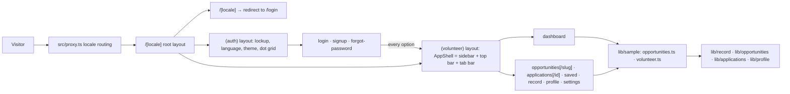

# Application Architecture

## Implemented

A single Next.js 16 App Router application: React 19, strict TypeScript,
Tailwind CSS 4, and `next-intl`. Every screen is a Server Component. There is
no API route, database client, authentication provider, or backend transport:
every signed-in screen renders an illustrative catalogue and volunteer from
`src/lib/sample/`, and the sign-in surfaces navigate to it.

## Module ownership

| Location                                                          | Responsibility                                                                                                                                                                                                                                                                |
| ----------------------------------------------------------------- | ----------------------------------------------------------------------------------------------------------------------------------------------------------------------------------------------------------------------------------------------------------------------------- |
| `src/proxy.ts`                                                    | Sends a prefix-less URL to a locale using `Accept-Language`; the only code path outside a page                                                                                                                                                                                |
| `src/app/[locale]/layout.tsx`                                     | Root document, `lang`, the two typefaces, the theme boot script, `noindex`, the client provider with `messages={null}`                                                                                                                                                        |
| `src/app/[locale]/page.tsx`                                       | Redirects to the entry route (`login`)                                                                                                                                                                                                                                        |
| `src/app/[locale]/(auth)/layout.tsx`                              | The sign-in frame: lockup, language and theme controls, centred column, footer, on the dot-grid ground                                                                                                                                                                        |
| `src/app/[locale]/(auth)/*/page.tsx`                              | Log in, create account, reset password                                                                                                                                                                                                                                        |
| `src/app/[locale]/(volunteer)/layout.tsx`                         | Builds the shell's user card and notification list from the sample and wraps every signed-in screen in `AppShell`; `force-dynamic`                                                                                                                                            |
| `src/app/[locale]/(volunteer)/*/page.tsx`                         | The volunteer sections and two detail pages, each `force-dynamic` so sample dates are relative to the request; `/saved` preserves old links by redirecting into Opportunities                                                                                                 |
| `src/app/[locale]/(volunteer)/not-found.tsx`                      | The 404 inside the panel, reached through `notFound()` from a detail page                                                                                                                                                                                                     |
| `src/app/global-not-found.tsx`                                    | 404 for unmatched URLs outside the locale tree                                                                                                                                                                                                                                |
| `src/app/robots.ts`                                               | Disallows every crawler; the application is private                                                                                                                                                                                                                           |
| `src/app/globals.css`                                             | Tailwind import, design tokens, base layer, container utility, scene system, meter, tab-bar inset                                                                                                                                                                             |
| `src/i18n/`                                                       | Locale definition, navigation helpers, request config with date formats, one catalog per locale                                                                                                                                                                               |
| `src/lib/routing/routes.ts`                                       | The app route registry: area, sidebar and tab-bar membership, the href helpers for detail pages, the active-path rule                                                                                                                                                         |
| `src/lib/seo/origin.ts`                                           | This origin and the marketing origin, both read from configuration and never guessed                                                                                                                                                                                          |
| `src/lib/security/headers.ts`                                     | The CSP and security headers `next.config.ts` sends                                                                                                                                                                                                                           |
| `src/lib/theme.ts`                                                | Theme preference, the inline boot script, the `data-motion` flag                                                                                                                                                                                                              |
| `src/lib/datetime.ts`                                             | Tashkent calendar-day arithmetic and the relative-instant helper the sample uses                                                                                                                                                                                              |
| `src/lib/record/levels.ts`                                        | Level thresholds, the reliability rule, attendance outcomes, participation entries                                                                                                                                                                                            |
| `src/lib/opportunities/`                                          | Region, format, status and question vocabulary; deadline state; URL filter parsing and the filter itself                                                                                                                                                                      |
| `src/lib/applications/status.ts`                                  | Application statuses, predicates, the status groups, the timeline derivation                                                                                                                                                                                                  |
| `src/lib/profile/completion.ts`                                   | The six-field completion rule and the full profile shape                                                                                                                                                                                                                      |
| `src/lib/activity/`, `src/lib/notifications/`, `src/lib/account/` | Activity kinds, notification kinds, linked identities and preference keys                                                                                                                                                                                                     |
| `src/lib/sample/opportunities.ts`                                 | The ten-opportunity catalogue with descriptions, requirements and questions in three languages                                                                                                                                                                                |
| `src/lib/sample/volunteer.ts`                                     | The illustrative volunteer: profile, record, applications with answers, saved items, history, notifications, preferences, identities                                                                                                                                          |
| `src/components/ui/`                                              | `buttonClass`, `Field`, `Input`, `Textarea`, `Select`, `Switch`                                                                                                                                                                                                               |
| `src/components/brand/`                                           | The mark, the arc, the lockup, and the two provider marks                                                                                                                                                                                                                     |
| `src/components/motion/`                                          | `Scene`, `SplitWords`, the one observer, and `SmoothScroll`                                                                                                                                                                                                                   |
| `src/components/app/`                                             | The shell (`AppShell`, `Sidebar`, `SidebarNav`, `TopBar`, `TabBar`, `AppFooter`), its menus (`NotificationsMenu`, `UserMenu`), the language and theme controls, and the composition primitives (`Panel`, `StatTiles`, `PageHeader`, `Segmented`, `PreviewNote`, `StatusChip`) |
| `src/components/auth/`                                            | Intro, preview notice, panel, provider buttons, the form                                                                                                                                                                                                                      |
| `src/components/dashboard/`                                       | Next up, application rows, record progress, profile meter, activity feed, the status chips                                                                                                                                                                                    |
| `src/components/opportunities/`                                   | Filters, card, rows, facts, save button                                                                                                                                                                                                                                       |
| `src/components/applications/`                                    | The timeline                                                                                                                                                                                                                                                                  |
| `src/components/record/`                                          | The participation history table                                                                                                                                                                                                                                               |
| `src/components/profile/`                                         | The profile form                                                                                                                                                                                                                                                              |
| `src/components/settings/`                                        | Preference switches and the linked-identity list                                                                                                                                                                                                                              |

## Dependency direction

The route registry owns only route identity, area, navigation flags, href
helpers and the active-path rule. Pages compose components and domain rules.
Components may depend on `lib` and `i18n`; neither `lib` nor `i18n` may import
a page or a component. `lib/sample` may import every domain type and nothing
from `components`; it is the only module that knows the volunteer's name.

`src/lib/seo/origin.ts` is the one policy join between configured external
destinations and the interface. The marketing links return `null` while the
marketing origin is unset, so callers cannot accidentally render a link that
does not exist.

## Rendering rules

Server Components are the default. The client components are the ones that
own a browser API or interactive state, and all of them receive their copy as
props so no page-level translation reaches the browser:

- `LocaleSwitcher`, `NotificationsMenu`, `UserMenu` own a disclosure each:
  open state, outside-click and Escape handling.
- `SidebarNav` and `TabBar` need the pathname to mark the active section.
- `ThemeToggle` and `ThemeSwitch` need the document's theme.
- `Switch` owns its on/off state (or follows a controlled value) and emits a
  hidden input when it has a `name`.
- `OpportunityFilters` submits its own GET form when a select or the switch
  changes.
- `SaveButton` toggles its pressed state.
- `AuthForm` owns the submit handler, the password reveal, and the navigation.
- `ProfileForm` owns its "saved in preview" status.
- `SceneObserver` and `SmoothScroll` render nothing and own one browser API
  each.

The root layout gives `NextIntlClientProvider` `messages={null}`, as the
marketing site does: locale context reaches the client, no catalog does.

Every page calls `setRequestLocale` before reading translations. The sign-up
and reset pages are statically generated per locale; the login page reads
`?reset=sent`, and every signed-in screen is dynamic because the sample dates
itself relative to the request.

## The panel shell

`AppShell` lays out a sidebar and a column. The sidebar is sticky and full
height from the large breakpoint and absent below it; the column holds the top
bar, the workspace and the footer. On a phone the top bar carries the lockup and
the tab bar carries four essential destinations. Both navigations read the registry:
`navRoutes` for the main list, `accountRoutes` for profile and settings,
`tabBarRoutes` for the thumbs, and `ROUTE_ICONS` for the glyphs. Saved remains
a registered compatibility route but is intentionally absent from navigation.

Opportunity search is a plain GET form on the opportunities route, so a search
is a URL. The notifications menu receives its items already
translated and relative-timed from the volunteer layout; "mark all read" is
local state. The user menu links to profile, settings and sign out.

## Filters live in the URL

`parseOpportunityFilters` reads `q`, `region`, `format`, `open` and `sort` from
`searchParams`, falls back to defaults for anything unknown, caps the query,
and `filterOpportunities` narrows and sorts the catalogue with applicable
opportunities first. The filter form is a GET form: a select or the switch
submits it on change, the search field submits on Enter, and "clear filters"
retains the selected All or Saved view. A filtered screen can therefore be shared,
reloaded and switched between languages without losing its state, and the
application status groups work the same way through `?group=`.

## Sample data

Two modules. `sampleOpportunities(now)` is a catalogue of ten opportunities
across seven regions and three formats, in every state the chips know (open,
closing tomorrow, closing soon, full, closed), each with a description,
requirements and organiser questions in three languages. `sampleVolunteer(now)`
composes one volunteer from it: a profile missing one field, a record of five
confirmed events and one awaiting confirmation, five applications from draft
to rejected with answers, two saved items, a seven-row participation history
whose counts and hours agree with the record, five notifications, preferences
and linked identities. `sampleOpportunity(slug)` and `sampleApplication(id)`
back the detail pages and return `null` for an unknown key, which the page
turns into the panel's 404.

Every date is relative to `now` through `tashkentInstant`, and every signed-in
route is `force-dynamic`, so the demo never shows a deadline that has passed.
Tests pin the catalogue's coverage, the three languages, the count
consistency, and that no real partner is named.

## Entry scenes and smooth scrolling

Copied from the marketing site without change. The page header and stat tiles
use the `enter-*` keyframes because they are above the fold; every `Panel` is
its own `Scene` and rises once as it scrolls in.

## Configuration decisions

| Setting                                                                      | Where                                                          | Why                                                                                                                                 |
| ---------------------------------------------------------------------------- | -------------------------------------------------------------- | ----------------------------------------------------------------------------------------------------------------------------------- |
| `localePrefix: "always"`, `localeCookie: false`, `alternateLinks: false`     | `src/i18n/routing.ts`                                          | Same reasons as the marketing site: one language per URL, nothing stored, nothing in headers                                        |
| `timeZone: "Asia/Tashkent"` and named date formats                           | `src/i18n/request.ts`                                          | Server and client format every date identically; the panel uses `day`, `date`, `weekday` and `time`                                 |
| Port 3001                                                                    | `package.json`, `.claude/launch.json`, `src/lib/seo/origin.ts` | The marketing site takes 3000 and the API takes 4000, so all three run side by side; `v-web`'s `NEXT_PUBLIC_APP_ORIGIN` points here |
| `dynamic = "force-dynamic"` on the volunteer layout and every signed-in page | `(volunteer)/`                                                 | Sample dates are relative to the request                                                                                            |
| `experimental.globalNotFound`                                                | `next.config.ts`                                               | The root layout sits under `[locale]`, so a 404 for an unmatched URL cannot be composed from a layout                               |
| `X-Robots-Tag: noindex` on every response                                    | `src/lib/security/headers.ts`                                  | Every screen is private; the plan introduces a per-route policy only when a public route exists                                     |
| Theme in `localStorage`, not a cookie                                        | `src/lib/theme.ts`                                             | A cookie would reach the server; the boot script applies the stored value before paint                                              |

## Dependency boundary

Runtime dependencies are `next`, `react`, `react-dom`, `next-intl`,
`class-variance-authority`, `clsx`, `tailwind-merge`, `lucide-react`, and
`three`. The Three.js module is dynamically imported for the dashboard orbit.
Filters use native
GET forms rather than `nuqs`; menus and switches are disclosure buttons rather
than Radix; the profile form is an uncontrolled form rather than React Hook
Form. Each of those returns only when a phase of the implementation plan names
a concrete need.

## Presented, not implemented

Sign-in, account creation, password reset, applying, withdrawing, saving a
profile, saving an opportunity beyond the page, storing a preference, linking
or unlinking a sign-in method, signing out everywhere, deleting an account.
This repository presents them; it does not implement them, and every control
that would do one of them is either local state only or disabled with a
`PreviewNote` beside it.

## Needs verification

- Endpoint shapes and error contracts once `../v-backend` implements them
- Whether opportunity content is localized by the organiser or by the team
- Hosting provider and deployment topology
