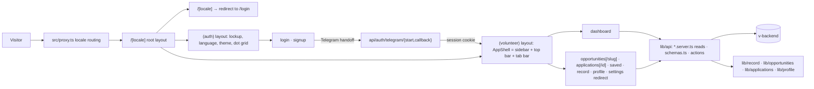

# Application Architecture

## Implemented

A single Next.js 16 App Router application: React 19, strict TypeScript,
Tailwind CSS 4, and `next-intl`. Every screen is a Server Component. Sign-in
is Telegram's OpenID Connect flow, carried by two route handlers that end by
writing an encrypted session cookie; every signed-in screen reads `v-backend` through the server-only client
in `src/lib/api/`, and every write is a Server Action.

## Module ownership

| Location                                              | Responsibility                                                                                                                                                                                                                                                                                                |
| ----------------------------------------------------- | ------------------------------------------------------------------------------------------------------------------------------------------------------------------------------------------------------------------------------------------------------------------------------------------------------------- |
| `src/proxy.ts`                                        | Sends a prefix-less URL to a locale using `Accept-Language`; once sign-in is configured, also reads the session cookie, enforces each route's `guard`, rotates an expiring access token on a navigation, and marks signed-in responses `private, no-store`                                                    |
| `src/app/api/auth/telegram/{start,callback}/route.ts` | The two hops of Telegram sign-in: ask the backend for the authorization URL, bind its `state` to this browser with a cookie and redirect to Telegram; on return, check the state, redeem the code through the backend and write the session cookie                                                            |
| `src/lib/auth/`                                       | `config.ts` reads the two server-only variables; `session.ts` holds the cookie schema, its JWE encryption and `safeReturnPath`; `session.server.ts` reads and writes it through `cookies()`; `refresh.ts` rotates a refresh token; `actions.ts` is the sign-out Server Action                                 |
| `src/lib/api/`                                        | `client.server.ts`, the one server-only client, built on `openapi-fetch` over `generated/schema.d.ts`: middleware adds the request id and turns every failure into an `ApiError`, the call adds the bearer token and the timeout, and Zod parses every response                                               |
| `src/app/[locale]/layout.tsx`                         | Root document, `lang`, the two typefaces, the theme boot script, `noindex`, the client provider with `messages={null}`                                                                                                                                                                                        |
| `src/app/[locale]/page.tsx`                           | Redirects to the entry route (`login`)                                                                                                                                                                                                                                                                        |
| `src/app/[locale]/(auth)/layout.tsx`                  | The sign-in frame: lockup, language and theme controls, centred column, footer, on the dot-grid ground                                                                                                                                                                                                        |
| `src/app/[locale]/(auth)/*/page.tsx`                  | Log in and create an account, both the Telegram handoff                                                                                                                                                                                                                                                       |
| `src/app/[locale]/(onboarding)/layout.tsx`            | The welcome frame: lockup back to the dashboard, language and theme controls, on the dot-grid ground; `force-dynamic`                                                                                                                                                                                         |
| `src/app/[locale]/(onboarding)/welcome/page.tsx`      | The four-step flow a new account lands on: reads `/profile`, `/me`, `/me/preferences` and the progress cookie, then hands one client flow the values and every label                                                                                                                                          |
| `src/app/[locale]/(volunteer)/layout.tsx`             | Re-checks the session, reads `/me`, `/record` and `/notifications` for the shell, wraps every section in `PanelErrorBoundary`, and renders `LoadErrorPanel` when those reads fail; `force-dynamic`                                                                                                            |
| `src/app/[locale]/(volunteer)/*/page.tsx`             | The volunteer sections and two detail pages, each `force-dynamic` and reading the backend per request; `/saved` preserves old links by redirecting to `/opportunities?view=saved`, `/settings` to `/profile`                                                                                                  |
| `src/app/[locale]/(volunteer)/not-found.tsx`          | The 404 inside the panel, reached through `notFound()` from a detail page                                                                                                                                                                                                                                     |
| `src/app/[locale]/(volunteer)/loading.tsx`            | The Suspense fallback for every section: `Skeleton` blocks in the shapes of a page header, tiles and two panels, announced once as a status                                                                                                                                                                   |
| `src/app/global-not-found.tsx`                        | 404 for unmatched URLs outside the locale tree                                                                                                                                                                                                                                                                |
| `src/app/robots.ts`                                   | Disallows every crawler; the application is private                                                                                                                                                                                                                                                           |
| `src/app/globals.css`                                 | Tailwind import, design tokens, base layer, container utility, scene system, meter, tab-bar inset                                                                                                                                                                                                             |
| `src/i18n/`                                           | Locale definition, navigation helpers, request config with date formats, one catalog per locale                                                                                                                                                                                                               |
| `src/lib/routing/routes.ts`                           | The app route registry: area, sidebar and tab-bar membership, the href helpers for detail pages, the active-path rule                                                                                                                                                                                         |
| `src/lib/seo/origin.ts`                               | This origin and the marketing origin, both read from configuration and never guessed                                                                                                                                                                                                                          |
| `src/lib/security/headers.ts`                         | The CSP and security headers `next.config.ts` sends                                                                                                                                                                                                                                                           |
| `src/lib/theme.ts`                                    | Theme preference, the inline boot script, the `data-motion` flag                                                                                                                                                                                                                                              |
| `src/lib/datetime.ts`                                 | Tashkent calendar-day arithmetic and a relative-instant helper used by tests                                                                                                                                                                                                                                  |
| `src/lib/record/levels.ts`                            | Level thresholds, the reliability rule, attendance outcomes, participation entries                                                                                                                                                                                                                            |
| `src/lib/opportunities/`                              | Region, format, status and question vocabulary; deadline state; URL filter parsing and the filter itself                                                                                                                                                                                                      |
| `src/lib/applications/status.ts`                      | Application statuses, predicates, the status groups, the timeline derivation                                                                                                                                                                                                                                  |
| `src/lib/profile/completion.ts`                       | The six-field completion rule and the full profile shape                                                                                                                                                                                                                                                      |
| `src/lib/notifications/`, `src/lib/account/`          | The notification shape, linked identities and preference keys                                                                                                                                                                                                                                                 |
| `src/lib/api/`                                        | The server-only client (`client.server.ts`), the authenticated call with refresh-and-retry (`session.server.ts`), one read module per domain (`*.server.ts`), the Zod schemas every response passes through (`schemas.ts`), error codes and the `ActionResult` envelope                                       |
| `src/lib/<domain>/actions.ts`                         | The Server Actions that write: apply, save and submit a draft, withdraw, save an opportunity, save the profile, a preference, mark notifications read, sign out                                                                                                                                               |
| `src/components/ui/`                                  | The shadcn/ui components: `Button` and `buttonClass`, `Badge`, `Card`, `Field`, `Input`, `Textarea`, `NativeSelect`, `Label`, `Switch` and `SwitchControl`, `DropdownMenu`, `Popover`, `AlertDialog`, `Table`, `Progress`, `Skeleton`, `Avatar`, `Separator`, `Toggle`, `Toaster`                             |
| `src/hooks/`                                          | `useServerAction` and `useOptimisticServerAction` (TanStack Query's `useMutation` around a Server Action) and `useActionForm` (React Hook Form validation in front of `useActionState`)                                                                                                                       |
| `src/lib/api/generated/`                              | `schema.d.ts`, generated by `npm run api:types` from `../v-backend/docs/api/openapi.json`; never edited by hand                                                                                                                                                                                               |
| `src/components/brand/`                               | The mark, the arc, the lockup, and the two provider marks                                                                                                                                                                                                                                                     |
| `src/components/motion/`                              | `Scene`, `SplitWords`, the one observer, and `SmoothScroll`                                                                                                                                                                                                                                                   |
| `src/components/app/`                                 | The shell (`AppShell`, `Sidebar`, `SidebarNav`, `TopBar`, `TabBar`, `AppFooter`), its menus (`NotificationsMenu`, `UserMenu`), the language and theme controls, `Providers`, and the composition primitives (`Panel`, `StatTiles`, `PageHeader`, `Segmented`, `StatusChip`, `ActionStatus`, `LoadErrorPanel`) |
| `src/components/auth/`                                | Intro, panel, status line, provider buttons, sign-out form                                                                                                                                                                                                                                                    |
| `src/components/dashboard/`                           | Next up, application rows, record progress, profile meter, activity feed, the status chips                                                                                                                                                                                                                    |
| `src/components/opportunities/`                       | Filters, card, rows, facts, save button                                                                                                                                                                                                                                                                       |
| `src/components/applications/`                        | The timeline                                                                                                                                                                                                                                                                                                  |
| `src/components/record/`                              | The participation history table                                                                                                                                                                                                                                                                               |
| `src/components/profile/`                             | The profile form                                                                                                                                                                                                                                                                                              |
| `src/components/settings/`                            | Preference switches and the linked-identity list                                                                                                                                                                                                                                                              |

## Dependency direction

The route registry owns only route identity, area, navigation flags, href
helpers and the active-path rule. Pages compose components and domain rules.
Components may depend on `lib` and `i18n`; neither `lib` nor `i18n` may import
a page or a component. `lib/api` may import every domain type and nothing
from `components`; `lib/api` is the only module that talks to the backend.

`src/lib/seo/origin.ts` is the one policy join between configured external
destinations and the interface. The marketing links return `null` while the
marketing origin is unset, so callers cannot accidentally render a link that
does not exist.

## Rendering rules

Server Components are the default. The client components are the ones that
own a browser API or interactive state, and all of them receive their copy as
props so no page-level translation reaches the browser:

- `LocaleSwitcher` and `UserMenu` are Radix dropdown menus and
  `NotificationsMenu` a Radix popover; Radix owns the open state, Escape,
  focus return and taps outside.
- `SidebarNav` and `TabBar` need the pathname to mark the active section.
- `ThemeToggle` and `ThemeSwitch` need the document's theme; both are the
  Radix switch, one as an icon button and one as a labelled track.
- `Switch` owns its on/off state (or follows a controlled value), emits a
  hidden input when it has a `name`, and renders `SwitchControl` inside.
- `OpportunityFilters` writes every change to the URL through `nuqs` with
  `shallow: false`, so the server re-renders the list; its GET form remains
  the path for a browser without JavaScript.
- `SaveButton`, `PreferenceSwitches` and `NotificationsMenu` call a Server
  Action through `useServerAction`; `useOptimisticServerAction` shows the
  requested value while the mutation is pending or has succeeded and resets
  once the server's value arrives.
- `ApplyForm`, `AnswersForm`, `WithdrawForm` and `ProfileForm` validate with
  React Hook Form and a Zod schema that mirrors the server rules, then post to
  a Server Action through `useActionState` and render its `ActionResult`. A
  saved profile or draft is a Sonner toast; an error stays an inline
  `ActionStatus`. `WithdrawForm` asks inside an `AlertDialog`.
- `Providers` mounts the TanStack `QueryClientProvider`, the `NuqsAdapter` and
  the `Toaster` once, inside the root layout.
- `PanelErrorBoundary` catches a section that failed to render and refreshes
  the router on retry.
- `SceneObserver` and `SmoothScroll` render nothing and own one browser API
  each.

The root layout gives `NextIntlClientProvider` `messages={null}`, as the
marketing site does: locale context reaches the client, no catalog does.

Every page calls `setRequestLocale` before reading translations. The sign-in
pages are dynamic because they read `?telegram=`, `?session=` and `?next=`,
and every signed-in screen is dynamic because it reads the backend on each
request.

## The panel shell

`AppShell` lays out a sidebar and a column. The sidebar is sticky and full
height from the large breakpoint and absent below it; the column holds the top
bar, the workspace and the footer. On a phone the top bar carries the lockup and
the tab bar carries four essential destinations. Both navigations read the registry:
`navRoutes` for the main list, `accountRoutes` for profile,
`tabBarRoutes` for the thumbs, and `ROUTE_ICONS` for the glyphs. Saved remains
a registered compatibility route but is intentionally absent from navigation.

Opportunity search is a GET form on the opportunities route, so a search is a
URL; with JavaScript, `nuqs` writes the same URL without a page load. The
notifications menu receives its items already translated and relative-timed
from the volunteer layout; "mark all read" is a mutation whose success hides
the badge until the layout re-reads. The user menu links to the consolidated
profile and calls the sign-out action.

## Filters live in the URL

`parseOpportunityFilters` reads `q`, `region`, `format`, `open` and `sort` from
`searchParams`, falls back to defaults for anything unknown, caps the query,
and `filterOpportunities` narrows and sorts the catalogue with applicable
opportunities first. It is the single parser: `src/lib/opportunities/search-params.ts`
wraps each key in a `nuqs` parser that calls it, adds the `view` parser, and
exports the serializer every filter link is built with, so a default value
never appears in a URL. On the client `OpportunityFilters` writes through
`useQueryStates` — a select or the switch on change, the search field on Enter
— with `history: "push"` and `shallow: false`, which is a server round trip
for the list; "clear filters" is a link that retains the selected All or Saved
view. Without JavaScript the same form submits as a GET request. A filtered
screen can therefore be shared, reloaded and switched between languages
without losing its state. The application status groups work the same way:
`src/lib/applications/search-params.ts` loads `?group=` on the server and
serializes the group links.

## Backend data

Every read is a function in `src/lib/api/<domain>.server.ts` that calls the
backend through `authed()` — which attaches the session's access token,
rotates it once on a 401 when a cookie can be written, and otherwise ends the
session through `/api/auth/session/expired` — and parses the body with a
schema from `src/lib/api/schemas.ts`. Underneath, `client.server.ts` is an
`openapi-fetch` client typed by `src/lib/api/generated/schema.d.ts`, so a path
autocompletes against the backend's OpenAPI document; `npm run api:types`
regenerates the file from `../v-backend/docs/api/openapi.json`, which
`v-backend` writes with `npm run openapi:generate`. The generated types
describe request shapes; the response contract stays the Zod schema, which is
why the client parses the body as text and hands it to Zod. The frontend type of an opportunity, an
application, a profile, the record, a notification or the preferences is the
schema's output; the two renames the backend needs (`sourcedByYvc`,
`readAt`) happen in the schema, nowhere else. Public opportunity reads use the
plain client. Detail reads are wrapped in React `cache()` so `generateMetadata`
and the page share one request. A `404` from a detail read becomes the panel's
404 through `notFound()`.

## Entry scenes and smooth scrolling

Copied from the marketing site without change. The page header and stat tiles
use the `enter-*` keyframes because they are above the fold; every `Panel` is
its own `Scene` and rises once as it scrolls in.

## Configuration decisions

| Setting                                                                      | Where                                                               | Why                                                                                                                                                                                                                                                                                                                                                                                                                                                                                                       |
| ---------------------------------------------------------------------------- | ------------------------------------------------------------------- | --------------------------------------------------------------------------------------------------------------------------------------------------------------------------------------------------------------------------------------------------------------------------------------------------------------------------------------------------------------------------------------------------------------------------------------------------------------------------------------------------------- |
| `localePrefix: "always"`, `localeCookie: false`, `alternateLinks: false`     | `src/i18n/routing.ts`                                               | Same reasons as the marketing site: one language per URL, nothing stored, nothing in headers                                                                                                                                                                                                                                                                                                                                                                                                              |
| `timeZone: "Asia/Tashkent"` and named date formats                           | `src/i18n/request.ts`                                               | Server and client format every date identically; the panel uses `day`, `date`, `weekday` and `time`                                                                                                                                                                                                                                                                                                                                                                                                       |
| Port 3001                                                                    | `package.json`, `.claude/launch.json`, `src/lib/seo/origin.ts`      | The marketing site takes 3000 and the API takes 4000, so all three run side by side; `v-web`'s `NEXT_PUBLIC_APP_ORIGIN` points here                                                                                                                                                                                                                                                                                                                                                                       |
| `dynamic = "force-dynamic"` on the volunteer layout and every signed-in page | `(volunteer)/`                                                      | Every signed-in screen reads the backend per request                                                                                                                                                                                                                                                                                                                                                                                                                                                      |
| `experimental.globalNotFound`                                                | `next.config.ts`                                                    | The root layout sits under `[locale]`, so a 404 for an unmatched URL cannot be composed from a layout                                                                                                                                                                                                                                                                                                                                                                                                     |
| `X-Robots-Tag: noindex` on every response                                    | `src/lib/security/headers.ts`                                       | Every screen is private; the plan introduces a per-route policy only when a public route exists                                                                                                                                                                                                                                                                                                                                                                                                           |
| Theme and language in cookies, not `localStorage`                            | `src/lib/preferences.ts`, `src/lib/theme.ts`, `src/i18n/routing.ts` | `localStorage` is keyed by origin, and the app and the marketing site are two origins, so a choice made on one was invisible to the other. A cookie scoped to the domain both share is visible to both and ignores the port, which also makes it work across 3000/3001 locally. The scope is derived from the origins already configured, so there is no extra variable to set or keep in step. The boot script still applies the value before paint, and adopts a pre-existing `localStorage` value once |

## Dependency boundary

Runtime dependencies are `next`, `react`, `react-dom`, `next-intl`,
`class-variance-authority`, `clsx`, `tailwind-merge`, `lucide-react`, `three`,
and — added by Telegram sign-in — `jose` for the encrypted session cookie,
`zod` for parsing every backend response, and `server-only` to keep the API
client and the cookie reader out of any client bundle. The Three.js module is
dynamically imported for the dashboard orbit.

`feat/ui-libraries` added the library layer in one decision, each package
against a component that had grown its own version of the same behaviour:

- `radix-ui`, reached only through the shadcn/ui components in
  `src/components/ui/`, for the menus, the popover, the switch, the dialog,
  the progress bar and the avatar. The components are shadcn's registry
  sources with the oklch palette, the `tw-animate-css` classes and the
  `destructive` role removed; every colour is a token or one of the aliases
  `globals.css` declares under shadcn's names.
- `react-hook-form` and `@hookform/resolvers`, with the existing `zod`, for
  client-side validation on the four forms. The schemas mirror the server's
  rules and live beside the FormData parsers in `src/lib/<domain>/`; the
  Server Action is still what validates.
- `nuqs` for the URL state of the opportunity filters and the application
  group, on top of `parseOpportunityFilters`, which stays the single parser.
- `@tanstack/react-query` for `useMutation` around the Server Actions behind
  a save button, a preference switch and "mark all read". No read moves to the
  client; the query client holds no cache of backend data.
- `sonner` for the two outcomes that used to be a status line: a saved profile
  and a saved draft.
- `openapi-fetch` under `client.server.ts`, with `openapi-typescript` as the
  generator of `src/lib/api/generated/schema.d.ts`.

Still out, on purpose: `next-safe-action` (the `ActionResult` envelope and
`resultFromError` already do its job), `next-themes` (the theme is forty lines
of `src/lib/theme.ts` and a cookie-free boot script), `motion`, `date-fns`
(`next-intl` formats every date), and any auth SDK.

## Not implemented

Google sign-in (the button renders `disabled` with a note), email and password
(the backend has none, so no form exists), linking or unlinking a sign-in
method, signing out everywhere, deleting an account, marking one notification
read on its own. Nothing presents them as working.

## Needs verification

- Endpoint shapes and error contracts once `../v-backend` implements them
- Whether opportunity content is localized by the organiser or by the team
- Hosting provider and deployment topology
