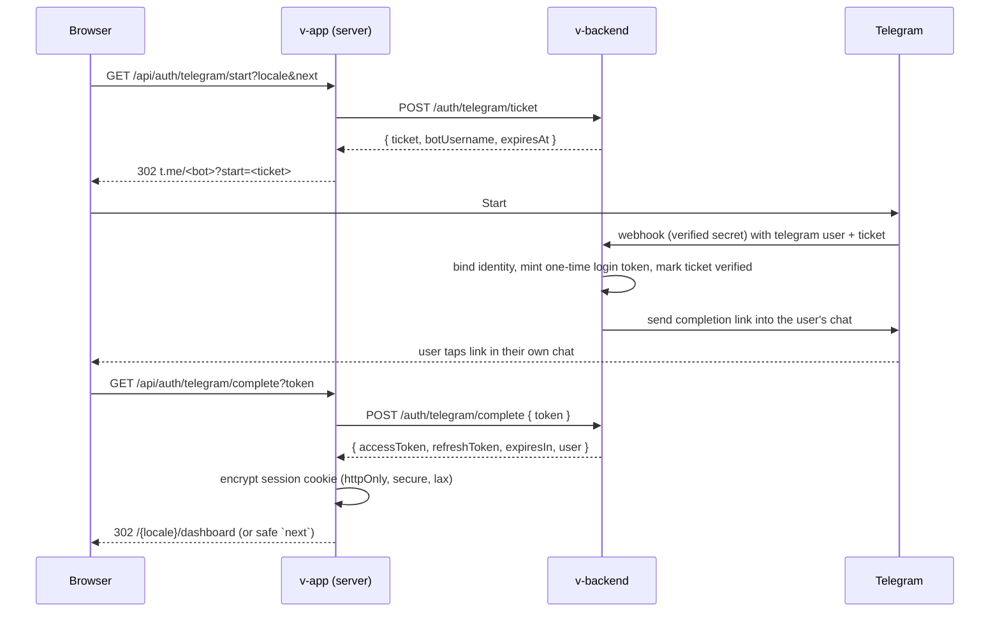

# Implementation Plan: Sign-in and the Volunteer Dashboard

How to turn the interface in this repository into a working product, in the
order that keeps every intermediate state honest. Read
[`../../AGENTS.md`](../../AGENTS.md) first; this plan assumes its rules.

## 0. Where we are

| Layer          | State today                                                                                                                                                                                                                                                                                                                                                                                                                                                                                                                                                    |
| -------------- | -------------------------------------------------------------------------------------------------------------------------------------------------------------------------------------------------------------------------------------------------------------------------------------------------------------------------------------------------------------------------------------------------------------------------------------------------------------------------------------------------------------------------------------------------------------- |
| `v-app` (this) | **Phases A, D and F are done.** Telegram sign-in, the encrypted session cookie, the route guards, proxy-side refresh, sign-out, and every section on backend data: `src/lib/api/*.server.ts` reads parsed by Zod schemas, and a Server Action for every write. The sample is deleted. Google renders disabled with a note; email and password (Phase B) and Google (Phase C) remain unbuilt on both sides. |
| `v-backend`    | Product endpoints exist. The Telegram ticket, webhook, completion, refresh and logout routes are implemented and now consumed by this app; `AuthTicket` also carries the volunteer's locale. Bot setup is `../v-backend/docs/operations/TELEGRAM_BOT_SETUP.md`.                                                                                                                                                                                                                                                                                                |
| `v-web`        | Links to the app through `NEXT_PUBLIC_APP_ORIGIN`; hides the sign-in action while it is unset.                                                                                                                                                                                                                                                                                                                                                                                                                                                                 |
| Archive        | `docs/reference/foundation-v1/legacy/` holds a previous, dependency-heavy implementation of the session cookie, the server-only API client, the Telegram route handlers, a profile form, an application form with essay autosave, and their tests. Port ideas from it; do not restore it wholesale.                                                                                                                                                                                                                                                            |

Three principles shape every phase:

1. **The backend is the only authority.** Identity comes from a verified
   token, never from a form field, a query string, or a cookie the browser
   can read. Frontend checks decide what is worth rendering, nothing more.
2. **Nothing claims to work before it does.** A phase replaces one on-screen
   "preview" or "sample" label only when the thing behind it is real and
   tested. Labels are removed by the phase that earns their removal.
3. **Same patterns as the marketing site.** Server Components, `navHref` and
   the route registry, tokens only, catalogs in three languages, no comments in
   source, docs updated in the same change. Dependencies are added by the
   phase that needs them and named here first.

## 1. The three ways in

The maintainers asked for the same entry points as the reference product
(dwelve.uz): Google, Telegram, and the three email forms — log in, create an
account, reset a password. They differ in who proves the identity.

| Method           | Who proves identity                           | Where the secret lives                                                | Result                                                            |
| ---------------- | --------------------------------------------- | --------------------------------------------------------------------- | ----------------------------------------------------------------- |
| Telegram         | Telegram, via the bot, in the user's own chat | Bot token in `v-backend`                                              | Backend issues access + refresh tokens                            |
| Google           | Google, via OpenID Connect                    | Client secret in `v-backend`; `v-app` holds only the public client id | Backend verifies the ID token / exchanges the code, issues tokens |
| Email + password | `v-backend`, against a password hash          | Hash and reset tokens in `v-backend`                                  | Backend issues tokens                                             |

In all three the browser ends up with one thing: an **httpOnly, encrypted
session cookie set by `v-app`'s server**, holding the backend's access token,
its expiry, and the refresh token. No token is ever readable by JavaScript.
This is the design the archived foundation already had (`legacy/src/lib/auth/`)
and the backend already expects (`docs/security/AUTH_AND_PRIVACY.md` in
`v-backend`).

### 1.1 Telegram (primary, already designed)



The property that must survive any redesign: **the tab that minted the ticket
never signs in by itself.** A forwarded deep link must not authenticate the
forwarder. The completion link lands in the Telegram chat of whoever pressed
Start, so it reaches the account holder.

### 1.2 Google (OpenID Connect, authorization code with PKCE)

```mermaid
sequenceDiagram
  participant B as Browser
  participant A as v-app (server)
  participant G as Google
  participant API as v-backend
  B->>A: GET /api/auth/google/start?locale&next
  A->>A: generate state, nonce, PKCE verifier; store hashes in a short-lived httpOnly cookie
  A-->>B: 302 accounts.google.com/o/oauth2/v2/auth (client_id, redirect_uri, scope=openid email profile, state, nonce, code_challenge)
  B->>G: consent
  G-->>B: 302 /api/auth/google/callback?code&state
  B->>A: callback
  A->>A: verify state matches cookie
  A->>API: POST /auth/google/exchange { code, codeVerifier, redirectUri, nonce }
  API->>G: token endpoint (client_secret)
  G-->>API: id_token, access_token
  API->>API: verify id_token (iss, aud, exp, nonce, email_verified), upsert GoogleIdentity + User
  API-->>A: { accessToken, refreshToken, expiresIn, user }
  A-->>B: session cookie + 302 /{locale}/dashboard
```

Decisions this needs:

- The code exchange happens in `v-backend`, so the client secret never enters
  the Next.js deployment. `v-app` only needs `NEXT_PUBLIC_GOOGLE_CLIENT_ID`
  (public by design) and its own redirect URI.
- Google's sign-in branding guidelines require the coloured "G" on the button.
  The current button uses a monochrome glyph to respect the "no third hue"
  rule. Phase C either adopts the official coloured asset as a brand exception
  — the same category as the delivered logo files — or keeps the monochrome
  mark with the text "Continue with Google" and accepts the guideline
  deviation. This is a maintainer decision; record it in `.agent-memory`.
- `email_verified` must be true, or the account is created unverified and
  follows the email verification path.

### 1.3 Email and password

Three forms, all against `v-backend`:

| Form           | Backend                                                                                                                                                          | Frontend behaviour                                                                                                                                                   |
| -------------- | ---------------------------------------------------------------------------------------------------------------------------------------------------------------- | -------------------------------------------------------------------------------------------------------------------------------------------------------------------- |
| Create account | `POST /auth/email/register { fullName, email, password, locale }` → 201, sends a verification email; returns tokens immediately or after verification (decision) | Server Action; on success write the session (if tokens) and redirect to the dashboard with a "verify your email" notice, or to a "check your inbox" screen           |
| Log in         | `POST /auth/email/login { email, password }` → tokens, or `401 invalidCredentials`, or `423 locked`                                                              | Server Action; on success write the session and redirect to `next` or the dashboard; the error is a code the catalog translates                                      |
| Reset password | `POST /auth/email/reset-request { email }` → always 202; `POST /auth/email/reset { token, password }`                                                            | The request form always shows "if that email belongs to an account…"; the reset page (new route, `/reset-password?token=`) sets a new password and signs the user in |

Backend rules the frontend relies on: argon2id hashing, uniform timing on
login, rate limiting per email and per IP, single-use reset tokens stored as
hashes with a 30-minute expiry, and a `423` lockout after repeated failures
that the interface explains rather than hides.

### 1.4 One account, several ways in

- Identities are linked by **verified email**. A Google sign-in whose verified
  email matches an existing email-password account signs into that account
  and records a `GoogleIdentity`. A Telegram account has no email; linking it
  to an email account is an explicit, signed-in action in settings, not an
  automatic merge.
- "Create account" and "Log in" are the same operation for Google and
  Telegram; the pages exist because the email path needs both and because a
  first-time visitor expects to see "create account".
- Sign-out revokes the refresh token in `v-backend` **first**, then clears the
  cookie. A backend failure does not block the local sign-out.

## 2. Backend work (`v-backend`)

Each endpoint needs a DTO, a stable error code, authorisation, OpenAPI
decorators, and tests before it is called implemented.

### 2.1 Schema additions

```prisma
model EmailIdentity {
  id            String   @id @default(uuid()) @db.Uuid
  email         String   @unique
  emailVerified Boolean  @default(false)
  passwordHash  String?
  userId        String   @unique @db.Uuid
  user          User     @relation(fields: [userId], references: [id], onDelete: Cascade)
  createdAt     DateTime @default(now()) @db.Timestamptz(3)
  updatedAt     DateTime @updatedAt @db.Timestamptz(3)
}

model GoogleIdentity {
  id        String   @id @default(uuid()) @db.Uuid
  subject   String   @unique
  email     String
  userId    String   @unique @db.Uuid
  user      User     @relation(fields: [userId], references: [id], onDelete: Cascade)
  linkedAt  DateTime @default(now()) @db.Timestamptz(3)
}

enum OneTimeTokenPurpose { email_verification password_reset }

model OneTimeToken {
  id        String              @id @default(uuid()) @db.Uuid
  tokenHash String              @unique
  purpose   OneTimeTokenPurpose
  expiresAt DateTime            @db.Timestamptz(3)
  usedAt    DateTime?           @db.Timestamptz(3)
  userId    String              @db.Uuid
  user      User                @relation(fields: [userId], references: [id], onDelete: Cascade)
  @@index([userId, purpose])
}
```

Plus `User.email String? @unique` as the linking key, and an `AuditLog` entry
for every credential change.

### 2.2 Endpoints

| Endpoint                                                      | Purpose                                                                        | Notes                                                       |
| ------------------------------------------------------------- | ------------------------------------------------------------------------------ | ----------------------------------------------------------- |
| `POST /auth/telegram/ticket`                                  | Mint a ticket                                                                  | Already designed                                            |
| `POST /auth/telegram/complete`                                | Redeem the one-time login token                                                | Already designed                                            |
| `POST /auth/google/exchange`                                  | Exchange code + PKCE verifier, verify the ID token, upsert identity            | New                                                         |
| `POST /auth/email/register`                                   | Create an email identity, hash the password, send verification                 | New; rate limited                                           |
| `POST /auth/email/login`                                      | Verify the password, issue tokens                                              | New; uniform timing; lockout                                |
| `POST /auth/email/verify`                                     | Consume a verification token                                                   | New                                                         |
| `POST /auth/email/reset-request`                              | Always 202; send a reset link if the email exists                              | New; rate limited                                           |
| `POST /auth/email/reset`                                      | Consume the reset token, set the password, revoke refresh sessions             | New                                                         |
| `POST /auth/refresh`                                          | Rotate refresh token, issue a new access token                                 | Needed by every method                                      |
| `POST /auth/logout`                                           | Revoke the refresh session                                                     | Needed by every method                                      |
| `GET /me`                                                     | The signed-in user: id, display name, roles, linked identities, email verified | New; the dashboard header needs it                          |
| `GET /profile`, `PUT /profile`                                | The reusable profile                                                           | Planned                                                     |
| `GET /record`                                                 | Counts, hours, standout flag                                                   | Planned                                                     |
| `GET /applications?limit=`                                    | Applications with opportunity summaries                                        | Planned                                                     |
| `GET /opportunities?region=&status=open&sort=deadline&limit=` | Closing soon near you                                                          | Planned                                                     |
| `GET /saved`                                                  | Saved opportunities                                                            | Planned                                                     |
| `GET /activity?limit=`                                        | The recent-activity feed                                                       | **New contract** — derived from audit and attendance events |

Transport rules stay as the backend documents them: JSON, ISO 8601 with
offsets, `Authorization: Bearer`, `X-Request-Id` in and out, validation
failures as `{ code: "validationFailed", errors: { field: ["key"] } }`, and
protected bodies never accepting an ownership identifier.

Email delivery needs a provider decision (transactional email API or SMTP)
and three templates in three languages: verify, reset, and "someone signed in
with Google using your email" if linking is automatic.

## 3. Frontend work (`v-app`), in phases

Each phase ends with the default verification (`lint`, `typecheck`, `test`,
`build`, and `test:e2e` when routes change), the docs updated, and the labels
it earned removed.

### Phase A — The session boundary — **done**

Built as described below, with two deviations worth knowing:

- the session helpers live in `src/lib/auth/`, and the encryption itself is in
  `session.ts` rather than `session.server.ts`, because `src/proxy.ts` needs it
  and cannot import `next/headers`;
- the proxy guards every `(volunteer)` route whether or not the two server-only
  variables are set; unset, no session can exist and the app is closed, not
  previewed. `isAuthConfigured()` survives only in the two Telegram handlers.

1. Add `zod` and `jose` (the only two dependencies this phase needs).
2. `src/lib/auth/session.ts` and `session.server.ts`: an encrypted JWE cookie
   (`dir` + `A256GCM`, key = SHA-256 of `VOLONTYORLAR_SESSION_SECRET`),
   httpOnly, secure in production, `sameSite: lax`, 30 days. Port from
   `legacy/src/lib/auth/`; keep `safeReturnPath` and its tests.
3. `src/lib/api/client.server.ts`: one server-only fetch wrapper with a
   timeout, a request id, Zod response parsing, and one normalised error
   class with codes. Port from `legacy/src/lib/api/`. The API origin is a
   server-only variable, `VOLONTYORLAR_API_URL`, never `NEXT_PUBLIC_`.
4. `src/proxy.ts`: decrypt the cookie for `(volunteer)` and `(auth)` paths;
   redirect a signed-out visitor to `/login?next=`, a signed-in visitor away
   from the auth pages; add `Cache-Control: private, no-store` to signed-in
   responses. `(volunteer)/layout.tsx` re-checks the session as defence in
   depth. Extend `routes.ts` with a `guard: "session" | "guest" | "public"`
   flag so the proxy reads the registry instead of a second list.
5. Token refresh in the proxy only (Next allows cookie writes there and in
   actions, not during a render), with the single-use refresh token spent
   and re-persisted in one place.
6. Sign-out: a Server Action that calls `POST /auth/logout`, then clears the
   cookie, then redirects to `/login`. Replace the header's and footer's
   sign-out links with a form that posts to it.
7. `AppShell` takes its display name from the session, not the sample.
8. Tests: session encrypt/decrypt round trip, tampering yields `null`,
   `safeReturnPath` rejects `//evil` and backslashes, the proxy redirects
   with `next`, the guarded layout redirects.

Labels earned: all of them, once Phase F landed.

### Phase B — Email and password

1. Server Actions in `src/lib/auth/actions.ts`: `logIn`, `createAccount`,
   `requestReset`, `resetPassword`. Each validates with a Zod schema whose
   messages are catalog keys, calls the API, writes the session, and returns a
   typed result `{ ok: true } | { ok: false, code, fieldErrors }`. Decide
   between plain actions with this envelope and `next-safe-action`; do not mix
   the two.
2. `AuthForm` becomes a real form: `action` instead of `onSubmit`, `required`
   attributes, `useActionState` for pending and errors, inline field errors
   with `aria-describedby`, a root error with `role="alert"`, and the
   password-reveal toggle kept.
3. **An error colour needs a decision.** The palette defines no red. Options:
   a documented system colour checked against both hues (the archived
   foundation used `#B3261E` and recorded why), or errors carried by weight,
   an icon and words only. Decide, add the token to both themes with
   assertions in `design-tokens.test.ts`, and record it in `.agent-memory`.
4. New route `reset-password` (`/reset-password?token=`) registered in
   `routes.ts` with a page that sets a new password.
5. Verification state: a signed-in, unverified user sees a persistent notice
   on the dashboard with a "resend" action; the backend decides what an
   unverified account may do.
6. Catalog additions in all three languages: field errors, root errors,
   lockout, verification notice, reset confirmation.
7. Remove `PreviewNotice` from the three pages **only** for the email path
   once the actions are live; the provider buttons keep a per-button note
   until their phases land.

### Phase C — Google

1. Route handlers `src/app/api/auth/google/start/route.ts` and
   `callback/route.ts`: state, nonce, PKCE, short-lived httpOnly cookie for
   the transient values, exchange through the API, session write, redirect.
2. `NEXT_PUBLIC_GOOGLE_CLIENT_ID` and `GOOGLE_REDIRECT_URI` documented in
   `.env.example`; the button is hidden while the client id is unset, like
   every other unconfigured integration.
3. CSP: `form-action` must allow `https://accounts.google.com`; nothing else
   changes because the exchange is server-to-server.
4. Brand decision on the button mark (see 1.2).
5. Tests: state mismatch is rejected, a callback without a cookie is rejected,
   `next` is preserved through the round trip.

### Phase D — Telegram — **done**

1. Route handlers `src/app/api/auth/telegram/start/route.ts` and
   `complete/route.ts` call the two backend endpoints.
2. The login and sign-up pages explain the handoff (`auth.telegram.handoff`)
   and never poll.
3. `TELEGRAM_AUTH_COMPLETE_URL` in `v-backend` points at
   `/api/auth/telegram/complete` **without** a locale in the path. The locale
   travels with the ticket instead: `POST /auth/telegram/ticket` takes it, the
   backend stores it on the ticket and echoes it back as `?locale=` on the
   completion link. The plan's original path-based idea does not survive the
   Telegram in-app browser, which does not share the cookies of the tab that
   started the flow. A short-lived cookie is still set as a second source, and
   the default locale is the last fallback.
4. An expired or reused token redirects to `/{locale}/login?telegram=expired`
   with translated copy. The starting tab never receives a session; only the
   browser that opens the one-time link does.

### Phase E — Account linking and settings

1. `GET /me` drives a settings page: linked identities, verify email, link
   Google, link Telegram, change password, sign out everywhere.
2. Linking Telegram to an email account is an explicit action from a signed-in
   session; the same ticket flow with the session's user attached.
3. Deletion and data export wait for the retention policy the backend lists
   as an open decision.

### Phase F — The dashboard on real data — **done**

Built as described, with four deviations: the reads live in one module per
domain under `src/lib/api/`; a page reads with `Promise.all` and one
`PanelErrorBoundary` per section rather than `allSettled` per block; the
backend serves single-language text, so `LocalizedText` did not survive; and
no read is tag-revalidated, because the backend already caches public reads
for a minute and everything signed-in is `no-store`. Every write became a
Server Action returning the `ActionResult` envelope (plain actions, not
`next-safe-action`), and the error colour decision was "none": error states
use the sunk surface and ink.

1. `src/lib/dashboard/api.server.ts` (or one module per domain under
   `src/lib/<domain>/api.server.ts`): one server-only read per block, each
   parsed with a Zod schema that mirrors the backend's OpenAPI output.
2. The page reads them with `Promise.allSettled`, so one failing block shows
   its own error state and the rest render. Each block gets `loading`,
   `empty`, and `error` states; the `Block` component grows an `error` slot.
3. The level, deadline state, upcoming filter, and completion rule stay where
   they are; only the source of the counts changes.
4. Remove the sample: `src/lib/sample/` is deleted, the `common.sample`
   copy and the `StatusChip` go with it, and the tests that assert the
   sample's honesty are replaced by tests that assert the schemas.
5. Decide whether `LocalizedText` survives: if opportunity content is not
   localized by the backend, titles become plain strings.
6. Caching: signed-in reads are `no-store`; the closing-soon read may be
   revalidated for a couple of minutes with a tag, as the archive did for
   public opportunities.

### Phase G — Hardening

1. HSTS and `upgrade-insecure-requests` already key off an HTTPS
   `NEXT_PUBLIC_SITE_URL`; keep it that way and verify on the real host.
2. CSP review after Google; no `'unsafe-inline'` tightening until a third-party
   script exists.
3. `X-Robots-Tag: noindex` stays global until a public route exists; then
   replace the header with the per-route policy the archive documented, with
   `Cache-Control: private, no-store` on every signed-in response.
4. End-to-end assertions ported from the archive: private paths redirect with
   `next`, no token is reachable from `document.cookie` or storage, the API
   origin and session secret are absent from client bundles, only whitelisted
   query parameters ever appear.
5. Error reporting, if adopted, scrubs user content before sending.

### Phase H — Tests and the test-auth path

- Unit: every schema, the session helpers, the redirect helpers, the level
  and deadline rules (already present).
- Component: form pending and error states, the verification notice, the
  Telegram "check your chat" state.
- End to end: the signed-in journeys need a way to sign in without Google,
  Telegram or email. Add a **test-only** endpoint in `v-backend`, enabled by
  an environment flag that production validation refuses, which issues tokens
  for a seeded volunteer. Until it exists the signed-in journeys stay
  declared and skipped with the blocker named, as the archive did.

## 4. Order and milestones

```text
A session boundary ─┬─ B email + password ─┐
                    ├─ C Google             ├─ E linking + settings ─ G hardening
                    └─ D Telegram ──────────┘
                    └─ F dashboard on real data (needs A and the planned reads)
H tests run inside every phase; the e2e test-auth path unblocks the signed-in journeys
```

Milestones a maintainer can verify:

1. **A volunteer can sign in with email and see their own name** (A + B +
   `GET /me`).
2. **The dashboard shows their real record, applications and profile** (F).
3. **Google and Telegram both land on the same account** (C + D + E).
4. **The preview and sample labels are gone** because nothing is a preview.

## 5. Environment variables

| Variable                                   | Repository | Public? | Purpose                                        |
| ------------------------------------------ | ---------- | ------- | ---------------------------------------------- |
| `NEXT_PUBLIC_SITE_URL`                     | v-app      | yes     | This origin; transport headers                 |
| `NEXT_PUBLIC_MARKETING_URL`                | v-app      | yes     | Links to the marketing site                    |
| `NEXT_PUBLIC_GOOGLE_CLIENT_ID`             | v-app      | yes     | Google authorization request                   |
| `VOLONTYORLAR_API_URL`                     | v-app      | **no**  | Backend origin, server only                    |
| `VOLONTYORLAR_SESSION_SECRET`              | v-app      | **no**  | Session cookie encryption, 32+ chars           |
| `GOOGLE_REDIRECT_URI`                      | v-app      | no      | The registered callback                        |
| `AUTH_ENABLED`, `JWT_*`, `TELEGRAM_*`      | v-backend  | no      | Already defined                                |
| `GOOGLE_CLIENT_ID`, `GOOGLE_CLIENT_SECRET` | v-backend  | no      | Code exchange                                  |
| `EMAIL_*`                                  | v-backend  | no      | Delivery provider                              |
| `TEST_AUTH_ENABLED`                        | v-backend  | no      | Refused in production; seeds the e2e volunteer |

`npm run verify:release` should be added to `v-app` as the marketing site has
it, refusing to ship without an HTTPS site origin and the two server-only
values.

## 6. Decisions the maintainers must make

1. Whether email registration signs the user in immediately or after
   verification.
2. Whether Google linking to an existing email account is automatic on
   verified email or explicit from settings.
3. The error colour, or the decision to have none.
4. Google's coloured mark as a brand exception, or the monochrome glyph.
5. `next-safe-action` versus plain Server Actions with the result envelope.
6. The email delivery provider and sender domain.
7. Retention and deletion for credentials, tokens and audit rows; guardian
   consent for minors.
8. Whether opportunity content is localized, which decides the shape of every
   title in every contract.

## 7. Risks

- **Telegram webview.** Most volunteers arrive from Telegram, whose in-app
  browser may not share cookies with the system browser. The Telegram flow
  completes in the tab Telegram opens, which is the right side of that
  boundary; the Google flow should be tested inside the webview before launch.
- **Shared devices.** A 30-day cookie on a school computer is a real risk;
  "sign out everywhere" in settings and a shorter lifetime on public devices
  are the mitigations to consider.
- **Two repositories, one contract.** Every endpoint lands in `v-backend`'s
  OpenAPI output and is mirrored by a Zod schema here; a drift test that
  compares the two is worth adding in Phase F.
